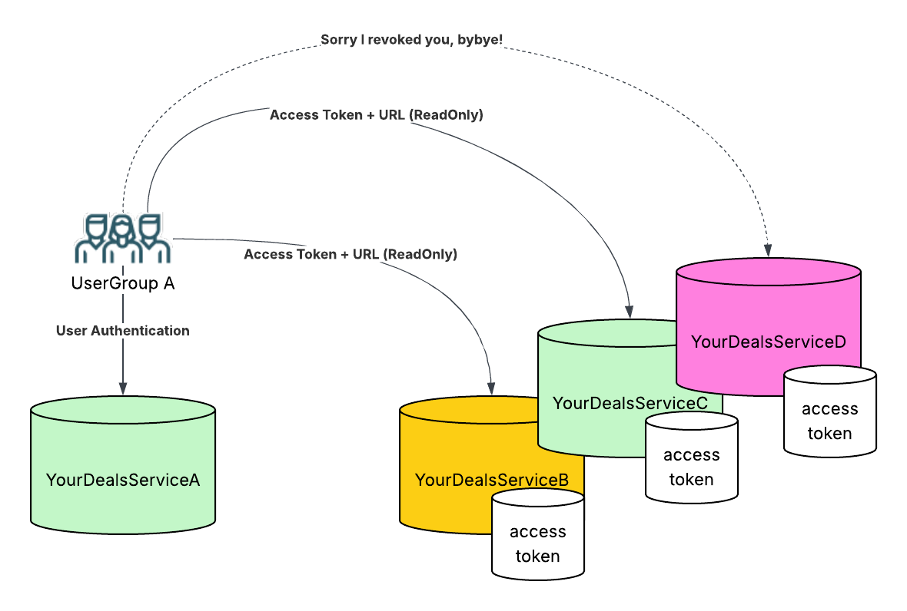

# GatherYourDeals-data

The data service for the GatherYourDeals project. It provides a server for storing and querying purchase data, with user authentication via JWT.



## Quick Start (without Docker)

**Prerequisites:** Go 1.25+, GCC (required by the SQLite driver)

```bash
go mod tidy
go build -o gatheryourdeals ./cmd/gatheryourdeals

export GYD_JWT_SECRET="$(openssl rand -hex 32)"
./gatheryourdeals init      # create database and admin account
./gatheryourdeals serve     # start the server on :8080
```

Logs are written to both stdout and rotating files in `./logs/`.

## Quick Start (with Docker)

**Prerequisites:** Docker and Docker Compose

```bash
cp .env.example .env

# Generate a random secret and paste it into .env
openssl rand -hex 32
# Edit .env and set GYD_JWT_SECRET to the generated value

docker compose run --rm app init    # create database and admin account
docker compose up --build           # start the server on :8080
```

Logs are written to stdout (visible via `docker compose logs`) and to rotating files persisted in `./data/logs/` on the host.

> **Note:** Docker Compose treats dollar signs in `.env` values as
> variable interpolation. If your secret contains dollar-sign characters
> (e.g. from `openssl rand -base64`), you will see warnings like
> *"The "mP" variable is not set"* and the secret will be silently
> corrupted. Use `openssl rand -hex 32` instead — hex output only
> contains `0-9` and `a-f`, so it avoids this issue entirely.
> If you must use a secret that contains a dollar sign, escape each one
> by doubling it (e.g. `$$`).

## Logging

All logs (Gin request logs and application logs) go to both stdout and a rotating log file. Log files are named with their creation timestamp, e.g. `gatheryourdeals-2025-04-05-14-30-00.log`. Only the two most recent files are kept.

Configure logging in `config.yaml`:

```yaml
log:
  dir: "logs"          # directory for log files (default: logs)
  max_size_mb: 10      # max file size before rotation (default: 10 MB)
```

| Setup | Log location on host |
|:------|:----|
| Local | `./logs/` |
| Docker | `./data/logs/` (mounted from container's `/data/logs/`) |

## Documentation

| Document | Description |
|:---------|:------------|
| [OpenAPI Spec](docs/api.yaml) | Full API specification (OpenAPI 3.0) |
| [API Examples](docs/api_examples.md) | curl examples for every endpoint |
| [Connection & Auth](docs/connection_and_auth.md) | Hosting, auth design, access keys |
| [Data Format](docs/data_format.md) | Purchase record format, metadata, ETL process |
| [Service Structure](docs/service_structure.md) | Project layout, CLI commands, design decisions |

## Key Features

- **Single binary** — server and admin CLI in one executable
- **Docker support** — multi-stage build, persistent volumes for database and logs
- **JWT authentication** — stateless access tokens, rotating refresh tokens
- **Role-based access** — admin and user roles enforced on every request
- **Flexible schema** — native fields as columns, user-defined fields as JSON
- **Structured logging** — stdout + rotating log files, Gin and app logs unified
- **SQLite with WAL mode** — lightweight, no setup required
- **Swappable database** — repository pattern allows switching to PostgreSQL
- **Embedded migrations** — schema managed by goose, compiled into the binary

# Future plan for deployment

⚠️compare price between railway and AWS
